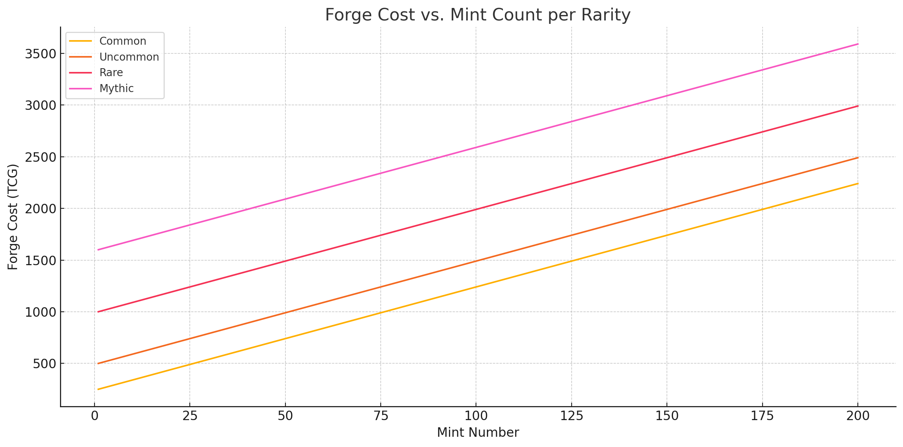

# ⛏️ Card NFT Forging / Leveling

#### 🏋️ Progression & Game Loop

* Players complete missions → Earn ESSENCE → Buy Packs → Build Decks
* Cards gain XP by participating in combat
* Cards level up to 25 through usage in PvP
* Once a card reaches level 25, it can be forged into an NFT using ESSENCE
* Forging resets the card’s level and grants it a golden frame, viewable in inventory and during combat
* Players must have a wallet linked to forge an NFT. Attempting to forge without one will route the player to wallet linking flow

<figure><figcaption></figcaption></figure>

**Card Leveling Mechanics:**

* Every card owned by the player has an individual level
* Monster cards gain XP while on the field
* When a monster delivers a killing blow, it earns `killedMonster.mana × 5` XP
* All allied monsters currently on the board also gain **half** that XP
* This mimics a team-based XP system, rewarding strategic play and field presence
* Once at level 25, the card will stop gaining XP until it is forged

<figure><figcaption></figcaption></figure>

**NFT Forging System:**

* Cards forged as NFTs are permanently gold-framed
* Forged cards are tradeable on the FM marketplace
* Forging cost increases globally with each new forged copy of the same card, making early mints more valuable
* Players are encouraged to specialize and level cards that fit their strategy

<figure><figcaption></figcaption></figure>

<figure><figcaption>
NFTs become more expensive to forge over time
</figcaption></figure>

<figure><figcaption>
NFT Supply Caps
</figcaption></figure>

***

#### 📦 TCG NFT Mint Caps

| **Rarity** | **Card Count** | 
<strong>1st Edition Cap</strong>

<em>(per card)</em>
 | 
<strong>Non-1st Cap</strong>

<em>(per card)</em>
 | 
<strong>Total Max Supply</strong>

<em>(per card)</em>
 |
| ---------: | -------------: | ----------------------------------------------------------------: | ------------------------------------------------------------: | -----------------------------------------------------------------: |
|     Common |            160 |                                                                75 |                                                         1,500 |                                                          **1,575** |
|   Uncommon |             92 |                                                                54 |                                                           750 |                                                            **804** |
|       Rare |             78 |                                                                26 |                                                           400 |                                                            **426** |
|     Mythic |             43 |                                                                23 |                                                           200 |                                                            **223** |

***


Learn more about [Deck Building](deck-building.md)

